在开始之前，我们需要了解策略的基本概念。

## 什么是策略？

策略是一组规则的集合，用于去检测和报警系统中的指标。

## 需要哪些东西？

1. 什么场景的告警策略？
2. 告警给谁？
3. 怎么展示？

针对上述问题，我们可以设计以下策略：

1. 系统 CPU 使用率过高：当系统 CPU 使用率超过 80% 时，发送邮件给管理员。

## 创建Hook

> Hook 是 Moon 用来与外部系统集成的一种方式。Moon 支持多种类型的 Hook，包括邮件、短信、电话、企业微信、飞书等。

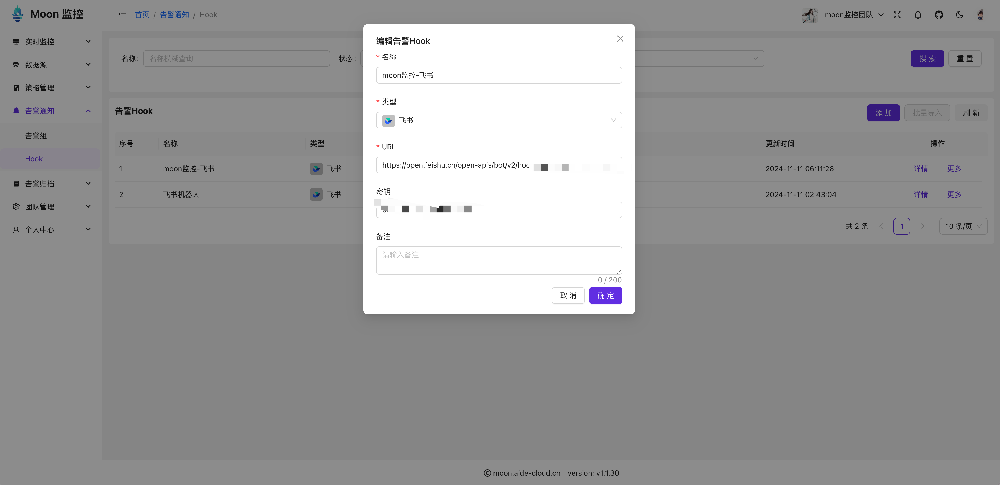

## 创建告警通知组

> 告警组是用于管理通知渠道的集合。里面包含人员（邮件、短信、电话）， Hook(Webhook、 DingTalk、企业微信、飞书等)

* 登录到 Moon 控制台，点击左侧导航栏的“告警通知->告警组”，点击“添加”按钮。

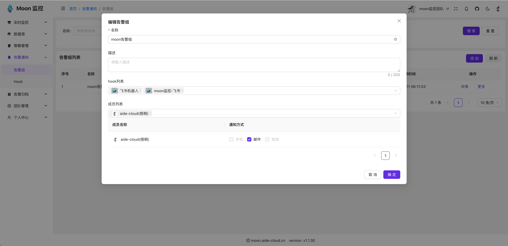

## 创建数据源

* 登录到 Moon 控制台，点击左侧导航栏的“数据源->Metric”，点击“新建数据源”按钮。

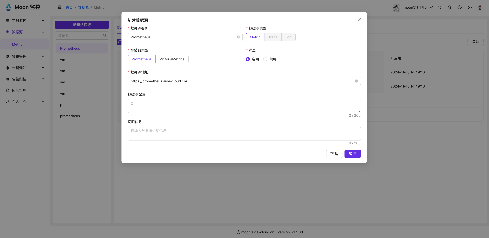

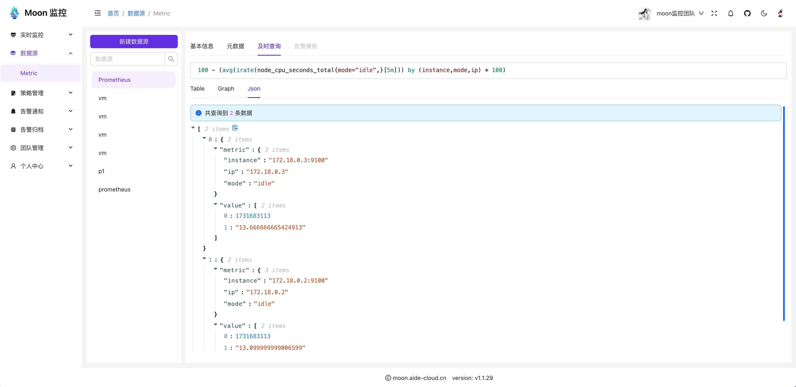

## 创建策略组

> 策略组是策略的集合，可以定义多个策略，每个策略可以关联多个数据源。

* 登录到 Moon 控制台，点击左侧导航栏的“策略管理->策略组”，点击“添加”按钮。

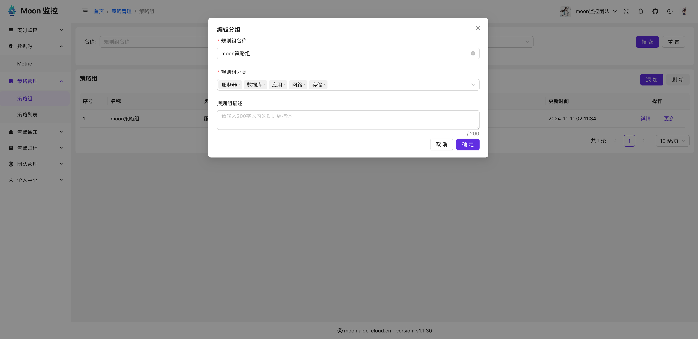

## 创建策略

> 策略是一组规则的集合，用于去检测和报警系统中的指标。

* 登录到 Moon 控制台，点击左侧导航栏的“策略管理->策略列表”，点击“添加”按钮。

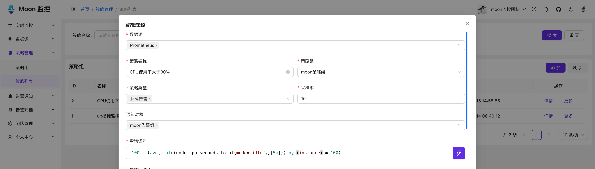

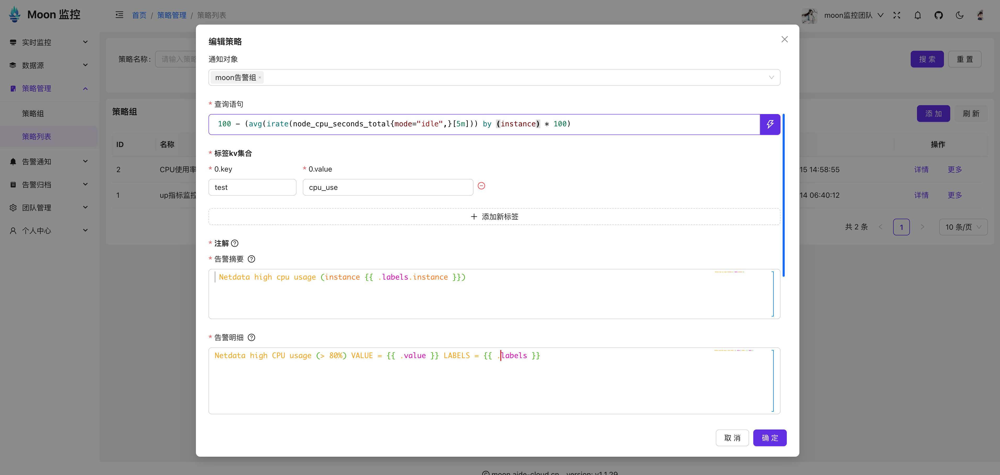

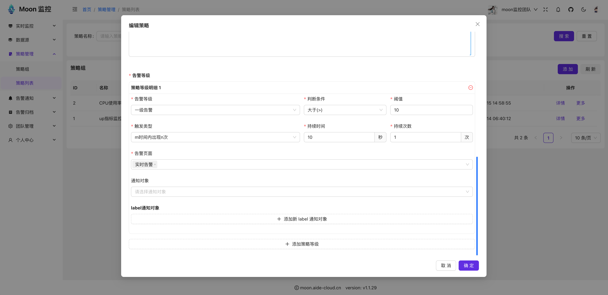

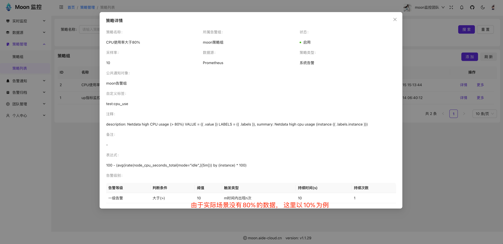

## 查看告警

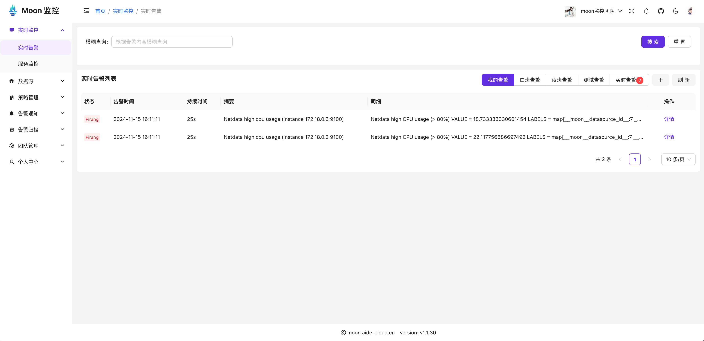

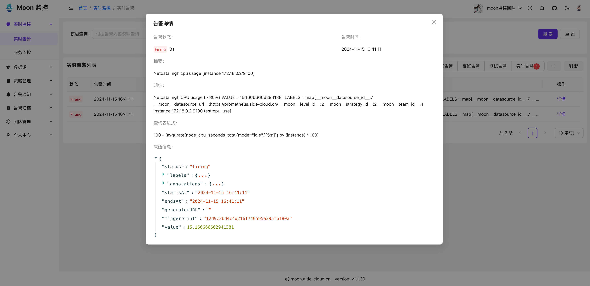

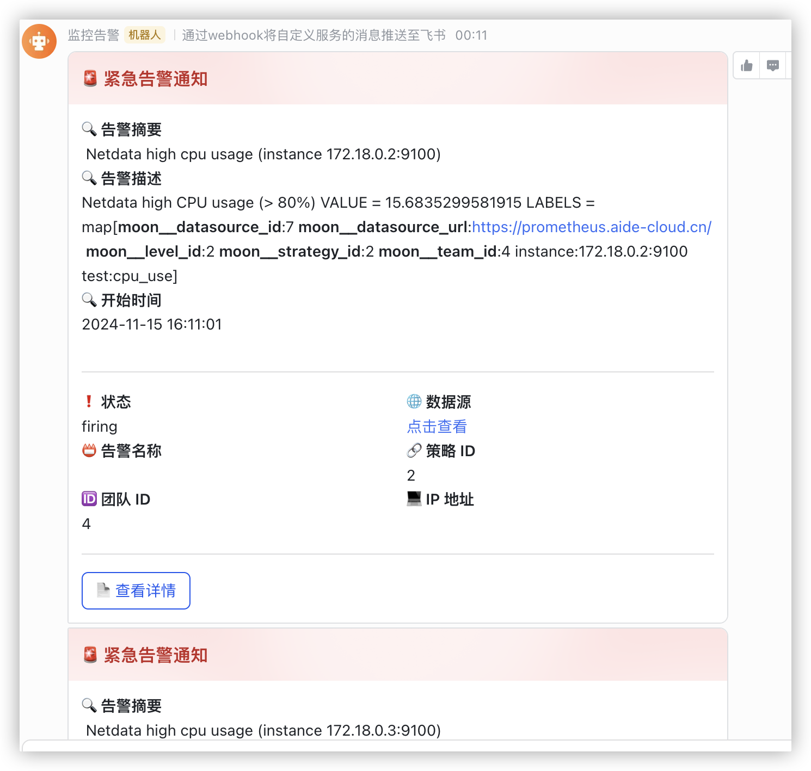

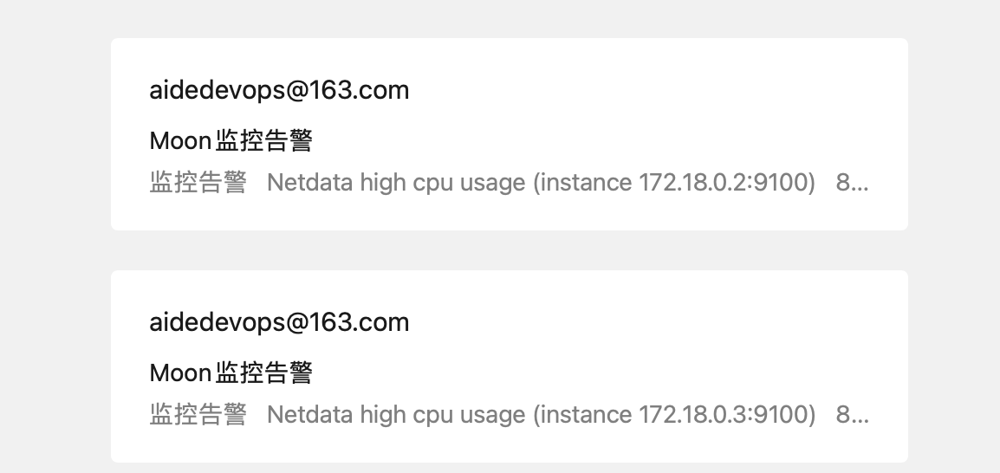

## 告警恢复

> 这里是修改策略的阈值为100%，告警恢复。也可以直接关闭策略来产生告警恢复事件

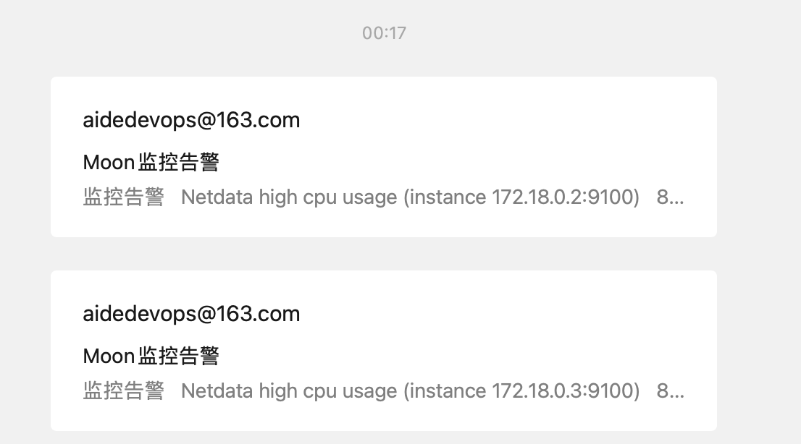

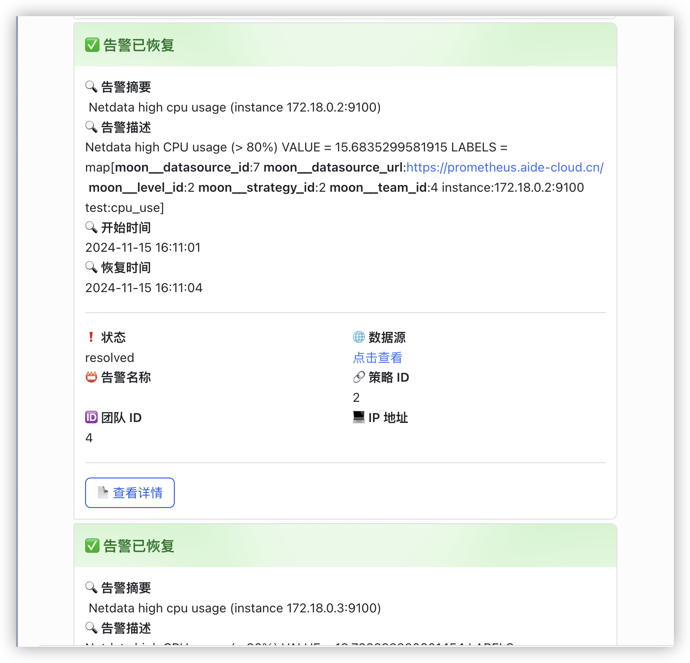

## 查看告警历史

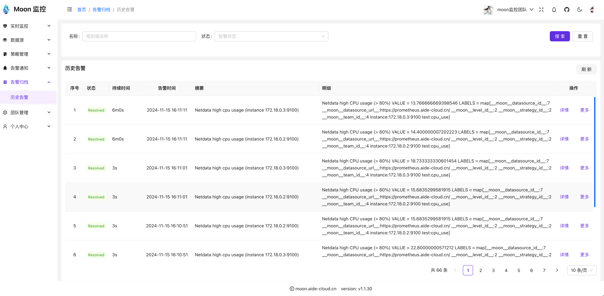