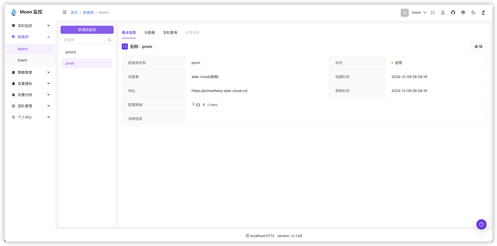
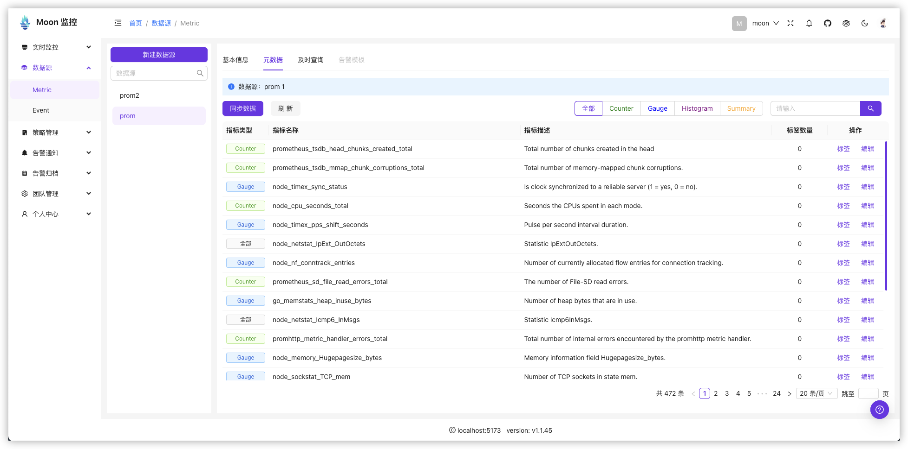
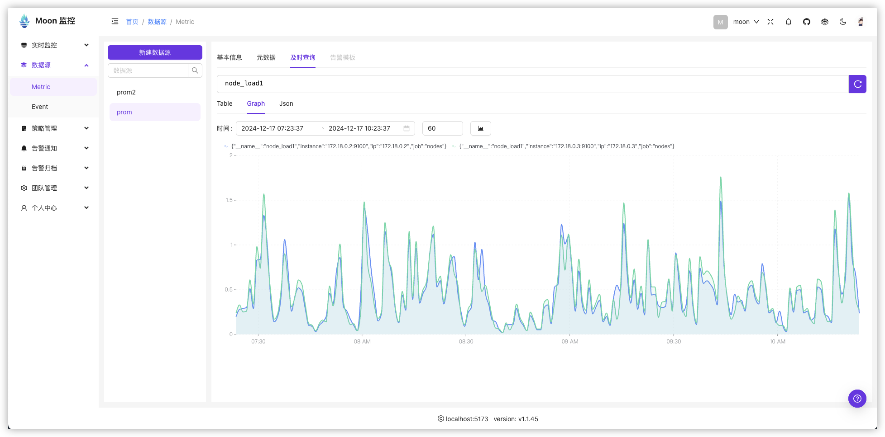
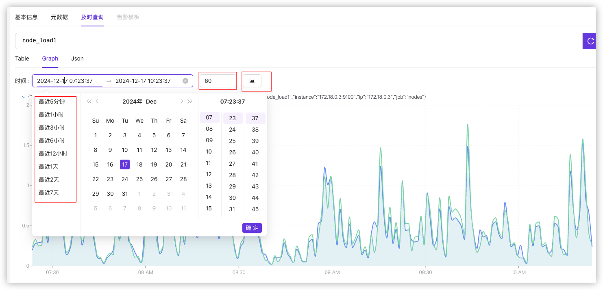
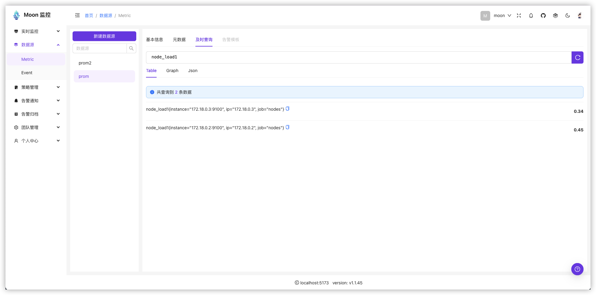
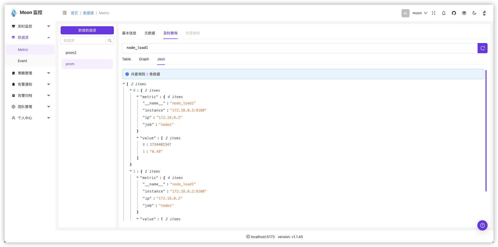

# 数据源

系统定义了四种数据类型：日志、指标、事件、 链路。 每种数据类型可以有多种数据存储器。 以这种形式，可以轻松实现数据类型的统一查询、分析、告警、可视化等。

## 指标（Metric）

实现统一的指标查询接口，以支持多种指标存储器。 在平台配置统一的指标策略完成指标类型数据的查询、分析、告警、可视化等。

[Prometheus](https://prometheus.io/)、[VictoriaMetrics](https://victoriametrics.com/)


### 接口定义

```go
// MetricDatasource 数据源完整接口定义
MetricDatasource interface {
    Step() uint32
    // Query 查询数据
    Query(ctx context.Context, expr string, duration int64) ([]*QueryResponse, error)
    // QueryRange 查询数据
    QueryRange(ctx context.Context, expr string, start, end int64, step uint32) ([]*QueryResponse, error)
    // Metadata 查询元数据
    Metadata(ctx context.Context) (*Metadata, error)
    // GetBasicInfo 获取数据源信息
    GetBasicInfo() *BasicInfo
}
```

### 基本信息



### 元数据



### 查询

:::tip

查询结果支持图表、表格、JSON三种形式。 PromQL 语法参考 [Prometheus](https://prometheus.io/docs/prometheus/latest/querying/basics/)。

输入框支持表达式、函数、变量、常量等语法提示，能帮助用户快速构建查询语句。

:::

* 图表



> 查询条件说明, 可以选择时间范围、数据稀疏程度， 图表样式



* 表格



* JSON



## 事件（Event）

实现统一的事件查询接口，以支持多种事件存储器。 在平台配置统一的事件策略完成事件类型数据的查询、分析、告警、可视化等。

[Kafka](https://kafka.apache.org/)、[RocketMQ](https://rocketmq.apache.org/)、[MQTT](https://mqtt.org/)

```go
// IMQ mq接口
type IMQ interface {
    // Send 发送消息
    Send(topic string, data []byte) error

    // Receive 接收消息 返回一个接收通道
    Receive(topic string) <-chan *Msg

    // RemoveReceiver 移除某个topic的接收通道
    RemoveReceiver(topic string)

    // Close 关闭连接
    Close()
}
```

## 日志（Log）开发中

实现统一的日志查询接口，以支持多种日志存储器。 在平台配置统一的日志策略完成日志类型数据的查询、分析、告警、可视化等。

[Elasticsearch](https://www.elastic.co/cn/products/elasticsearch)、[Loki](https://grafana.com/oss/loki/)

## 链路（Trace）开发中

实现统一的链路查询接口，以支持多种链路存储器。 在平台配置统一的链路策略完成链路类型数据的查询、分析、告警、可视化等。

[OpenTelemetry](https://opentelemetry.io/)、[Jaeger](https://www.jaegertracing.io/)
