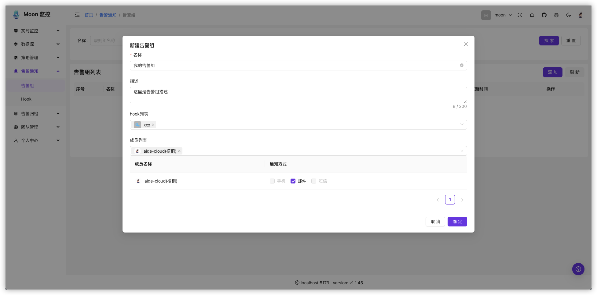
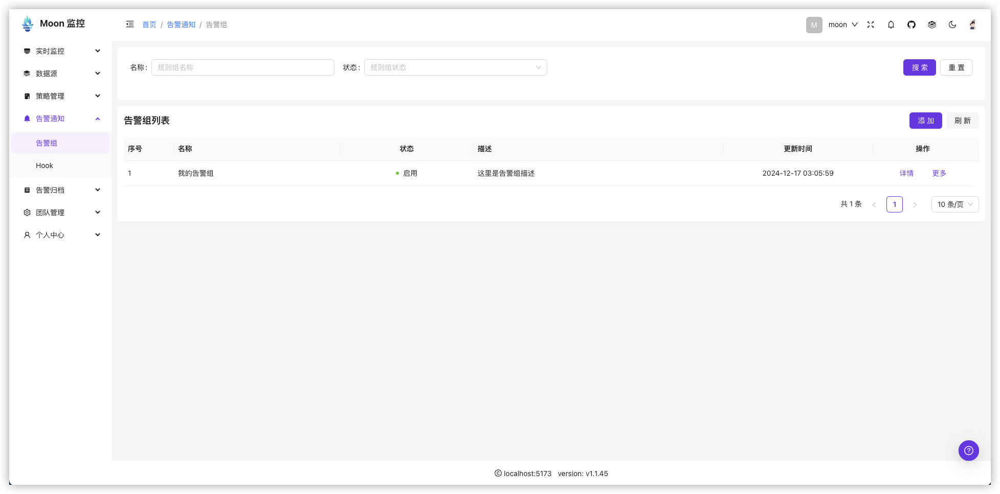
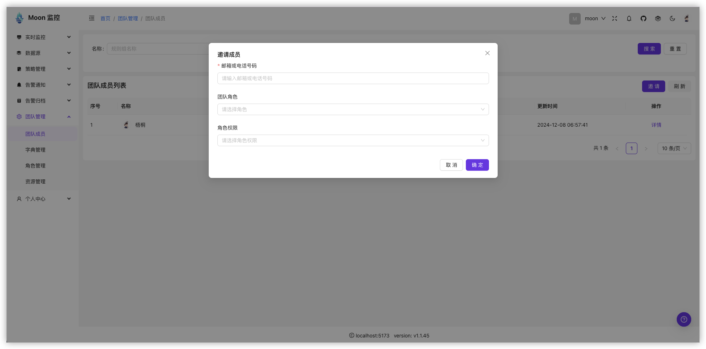
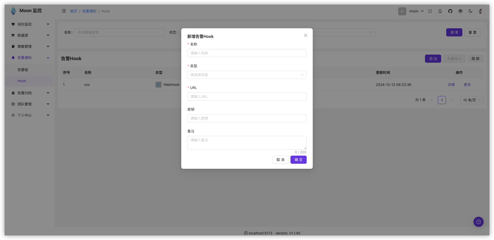

# 告警组

把开发 team、一个值班 team、运维 team 作为一个告警组，这或许是一种比较常见的告警组划分方式。这样他们可以共同关注到同一个告警。保证告警能被人及时处理。

告警组由多个告警人和多个告警渠道组成。 

  * 告警人： 告警组中的成员，租户下人员，支持邮件、短信、电话
  * 告警渠道： 告警通知的hook， 支持钉钉、飞书、企业微信等

告警组可以被多个告警策略使用。他们彼此独立。发送告警时候会根据告警策略的配置，选择告警组中的告警人和告警渠道发送告警。

## 创建告警组

:::tip

可以看到，告警组选择信息的时候，可以选择人和hook机器人。 人员来自于租户本身， hook需要我们从hook管理菜单下创建。

:::

## 告警组列表

## 邀请成员

> 在团队成员管理的地方，点击邀请按钮来邀请指定的系统成员, 被邀请人同意后，会自动加入到租户成员下， 然后就可以在告警组中被选择。

## 创建Hook

> 在告警组中选择hook机器人， 需要先在hook管理菜单下创建hook机器人。 当前hook类型支持钉钉、飞书、企业微信，以及自定义webhook， 前者会以模板的方式推送数据，后者会推送原始的alert message到webhook地址，由用户自定义完成告警通知。

