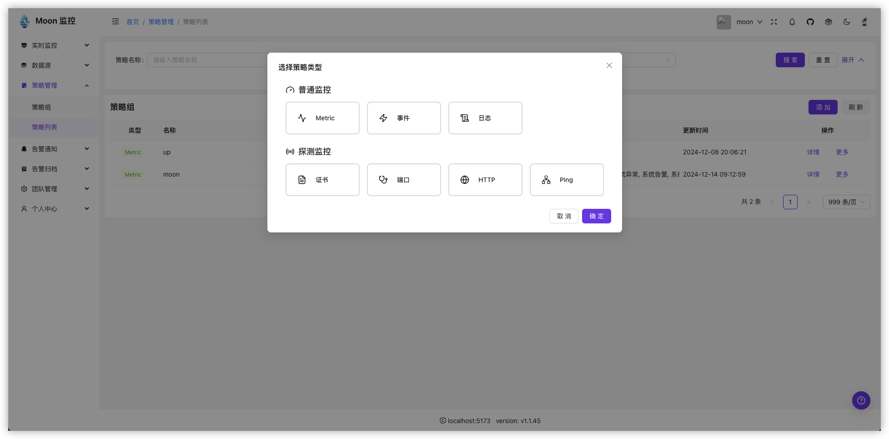
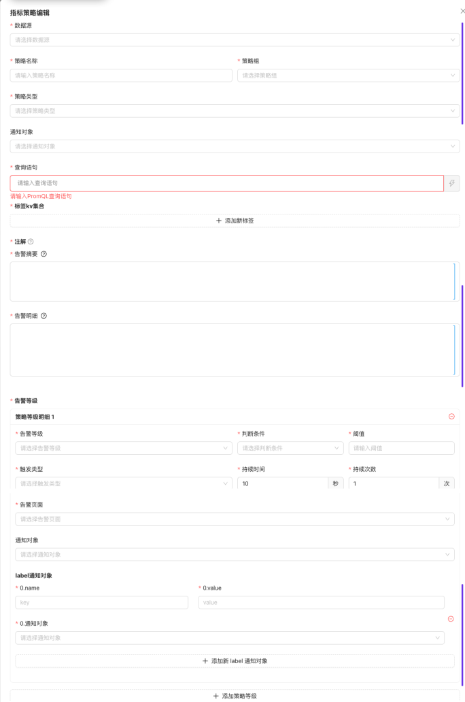
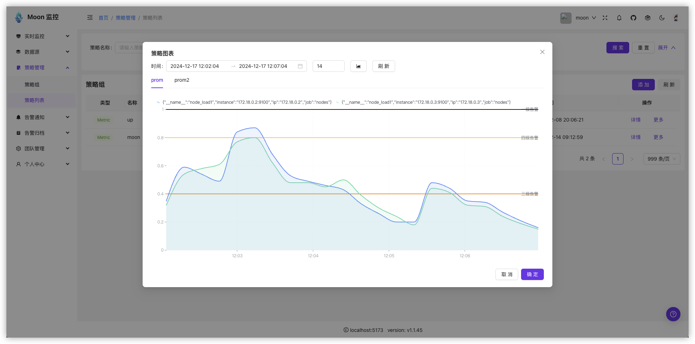
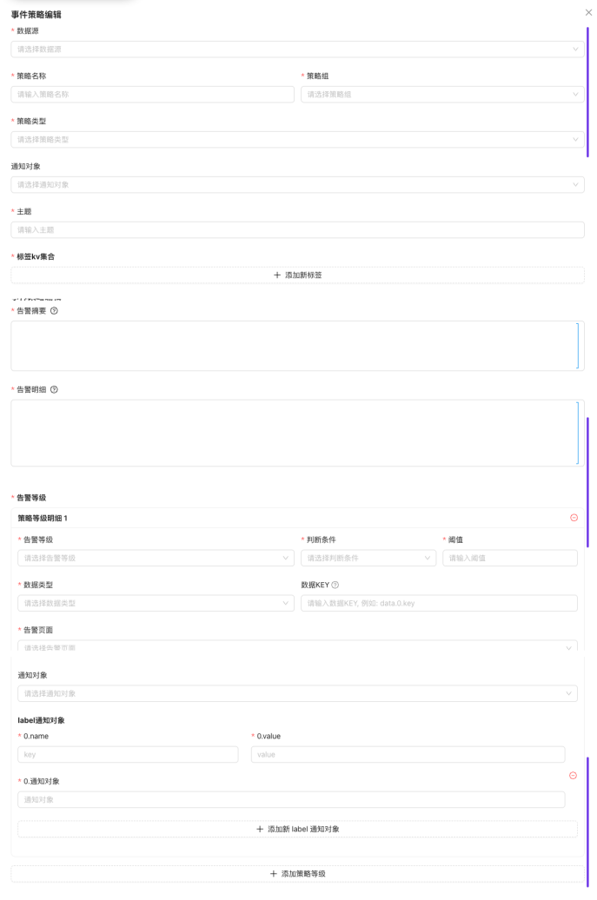
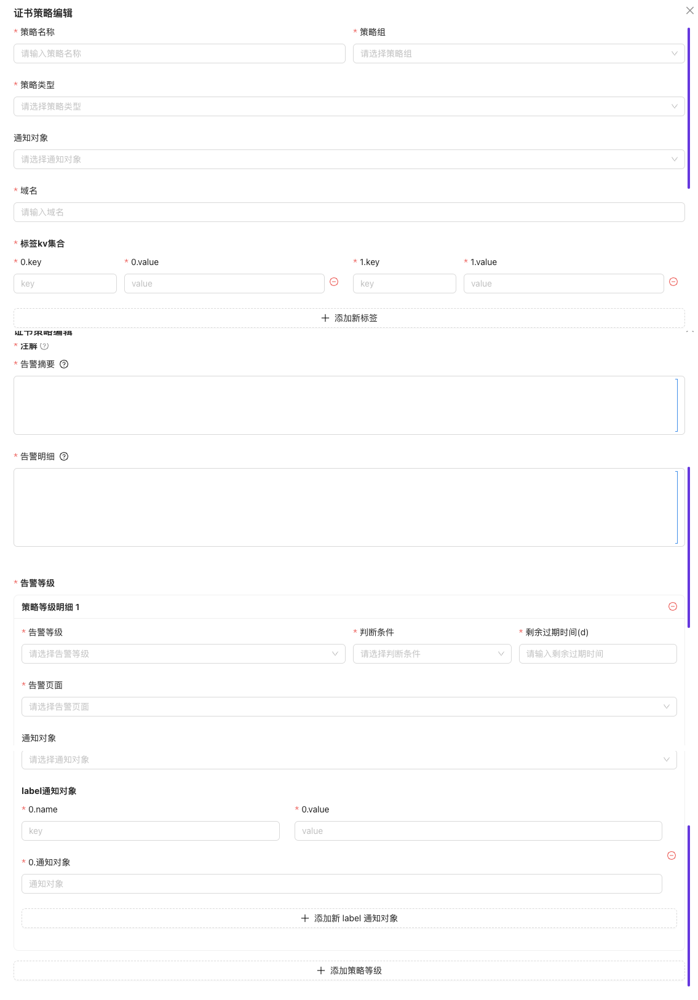
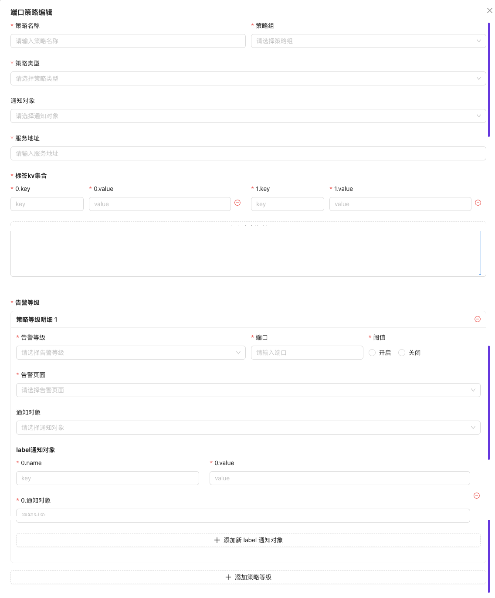
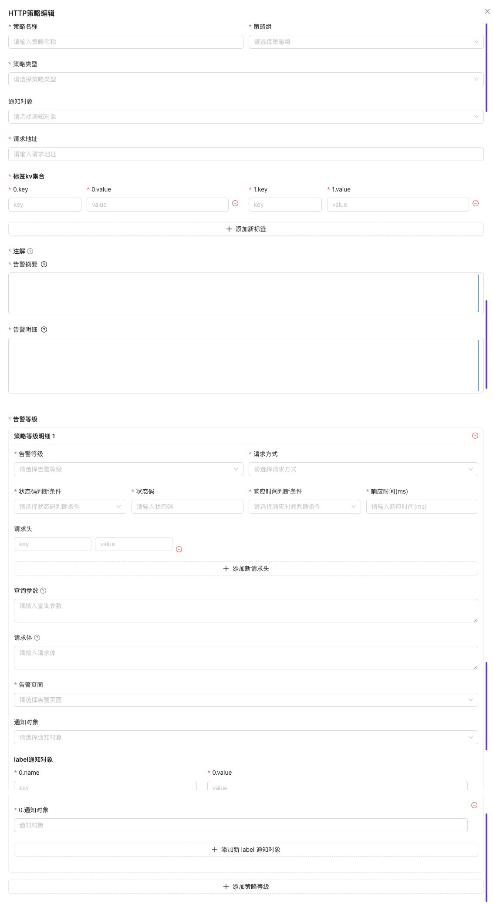

# 策略组和策略

在moon系统中， 所有的告警规则都统一称之为策略， 策略组是策略的集合。

为什么命名为策略呢？

    * 在moon系统中，同一个策略，会划分多个规则，每个规则可以有不同的阈值， 不同的告警等级， 一个策略至少包含一个规则数据（系统中称之为告警等级）
    * 在一个策略组中，可以包含不同类型的策略， 比如： 监控告警、日志告警、事件告警等，由这些不同的策略完成我们完整的业务场景全方位监控，因此，我更愿意称策略组为场景。

# 策略类型

整个系统有多种不同的数据源类型，我们为这些数据源类型提供了不同的策略类型，主要划分为两个大的模块（普通监控和探测监控）

## 普通监控

通过获取数据源数据， 经过策略设置的阈值， 告警等级， 告警组， 告警渠道， 告警人， 完成告警。

### 指标监控

 

* 策略图表

> 策略图表是metric类型策略的功能，可以看到这个metric策略的实时数据，以及告警等级对应的阈值线

### 日志监控 (开发中)

### 事件监控

## 探测监控

探测监控是基于特殊的探测协议，比如：tcp连接、http请求、ping、dns解析等，经过策略设置的阈值， 告警等级， 告警组， 告警渠道， 告警人， 完成告警。

### 证书监控

### 端口监控

### HTTP监控

### Ping监控
