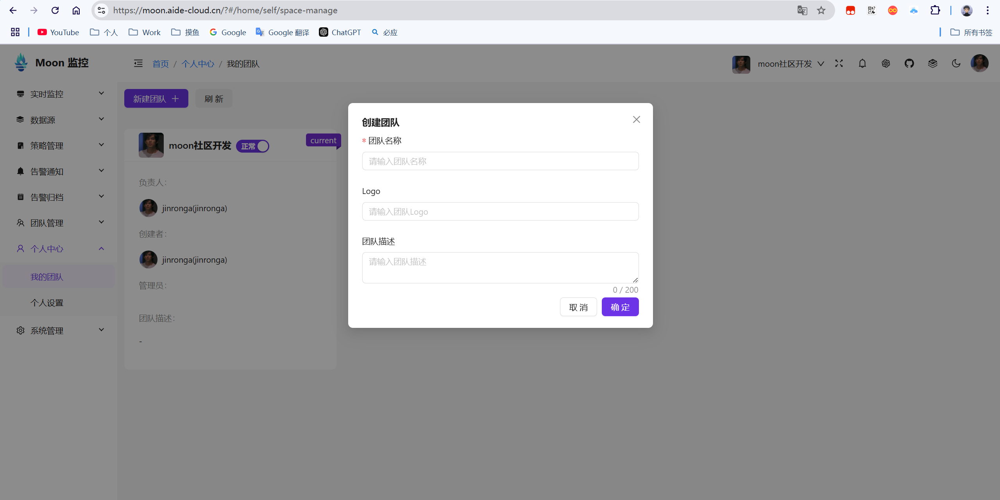
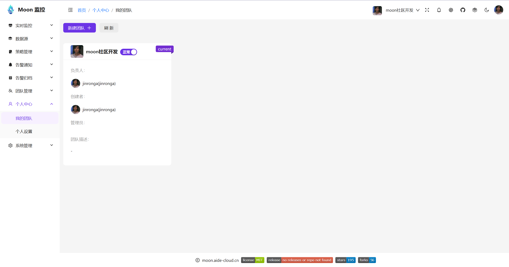
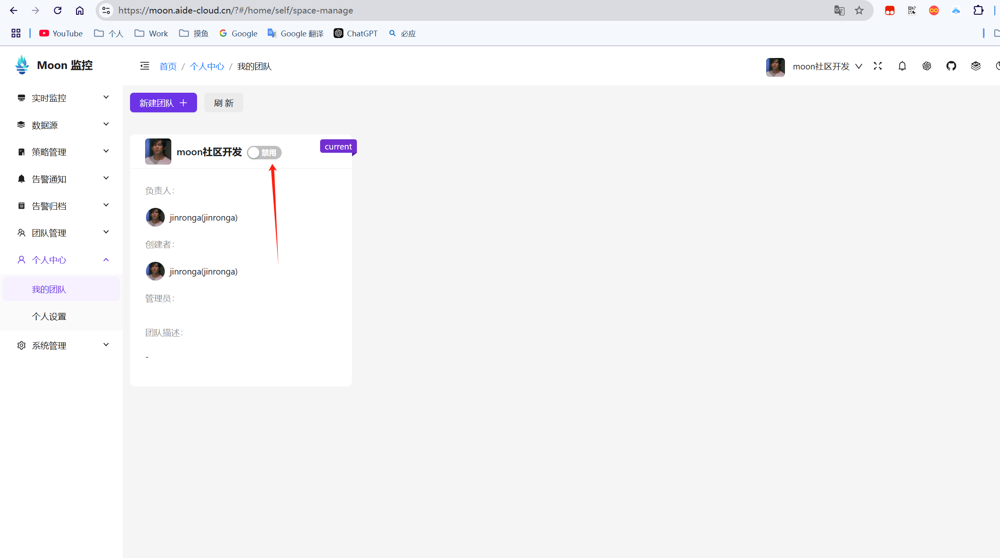
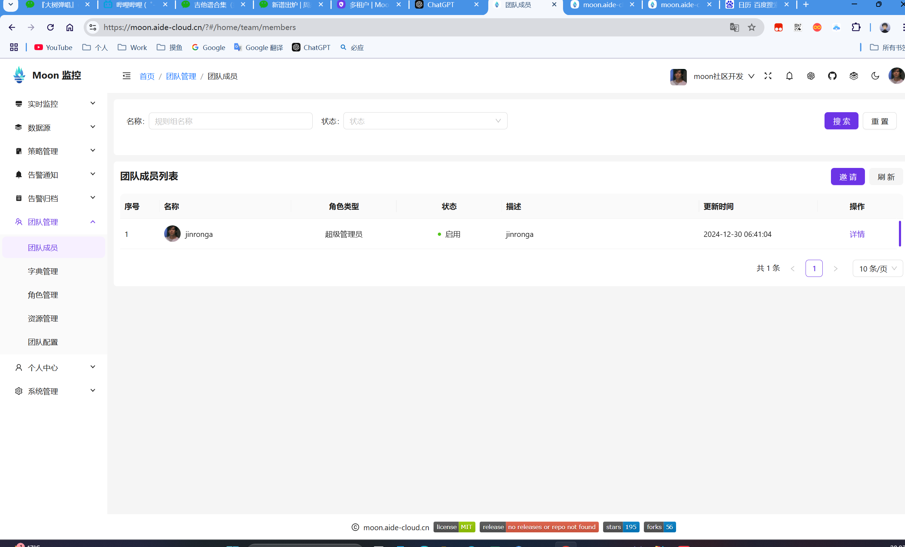
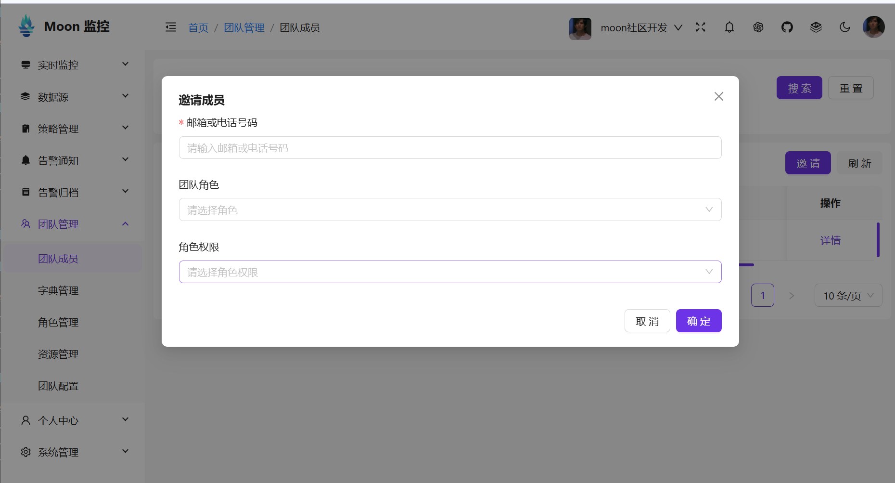

# 租户模块

租户（Tenant）是Moon中的一个核心概念，它代表了一个使用Moon的用户或组织。租户可以被创建、管理和使用，以实现多租户架构。

在Moon中拥有独立使用权限的单位，可以是公司、组织或个人用户。每个租户可能有多个用户，并可以独立管理自己的数据和配置。
资源共享与隔离

* 共享资源：所有租户共享同一个应用程序实例和底层基础设施（如计算资源、网络等），以提高资源利用率和降低成本。
* 数据隔离：确保每个租户只能访问自己的数据，防止数据泄露或混淆。
* 弹性扩展:多租户架构便于系统随着租户数量的增加动态扩展，支持高并发和大规模用户访问。

## 新建租户

1. 登录Moon控制台，选择左侧菜单中的“个人中心-我的团队”。
2. 点击“新建团队”按钮，输入团队名称、logo、描述，并设置团队管理员。
3. 点击“确定”按钮，完成团队创建。

## 租户列表

1. 登录Moon控制台，选择左侧菜单中的“个人中心-我的团队”。
2. 租户列表中显示了所有租户的信息，包括团队名称、logo、描述、管理员、创建时间等。

## 租户状态
1. 登录Moon控制台，选择左侧菜单中的“个人中心-我的团队”。
2. 租户状态中显示了所有租户的状态信息。
3. 开启关闭租户，开启租户后，该租户下的所有用户将可以使用Moon平台。

* 开启状态

* 关闭状态

## 租户成员
1. 登录Moon控制台，选择左侧菜单中的“团队管理-团队成员”。
2. 租户成员中显示了所有租户的成员信息。
3. 添加成员、移除成员，添加成员后，该成员将可以使用Moon平台。

## 租户空间切换
1. 登录Moon控制台，选择头部导航栏右侧“团队空间切换”。
2. 租户空间切换中显示了所有租户的团队空间信息。
3. 点击切换团队空间，即可切换到指定团队空间。

## 租户成员邀请
1. 登录Moon控制台，选择左侧菜单中的“团队管理-团队成员”。
2. 点击邀请按钮，弹出邀请成员弹窗。
3. 通过邮箱、手机号，设置团队角色、角色权限后点击确定按钮，完成邀请发送。
4. 邀请成员后，被邀请成员将收到邀请邮件，点击邮件中的链接即可完成注册。

