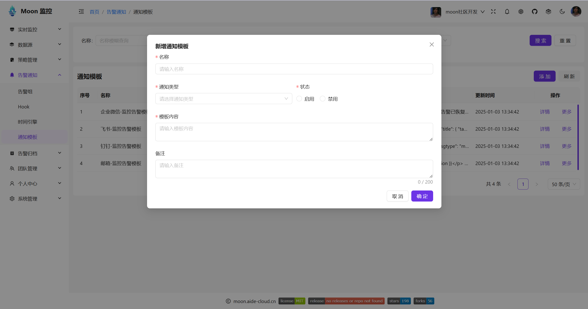
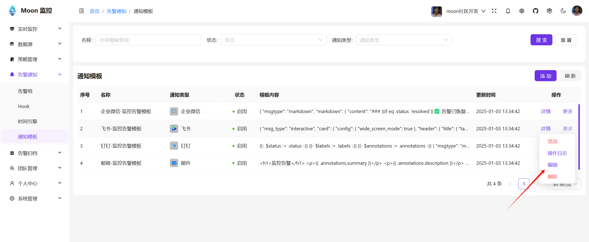
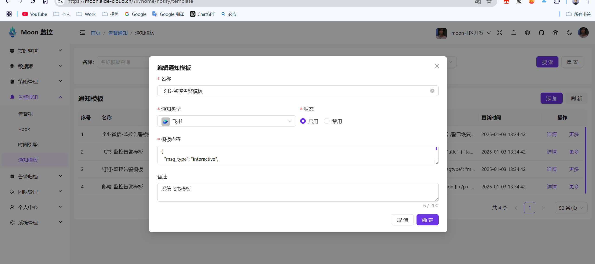
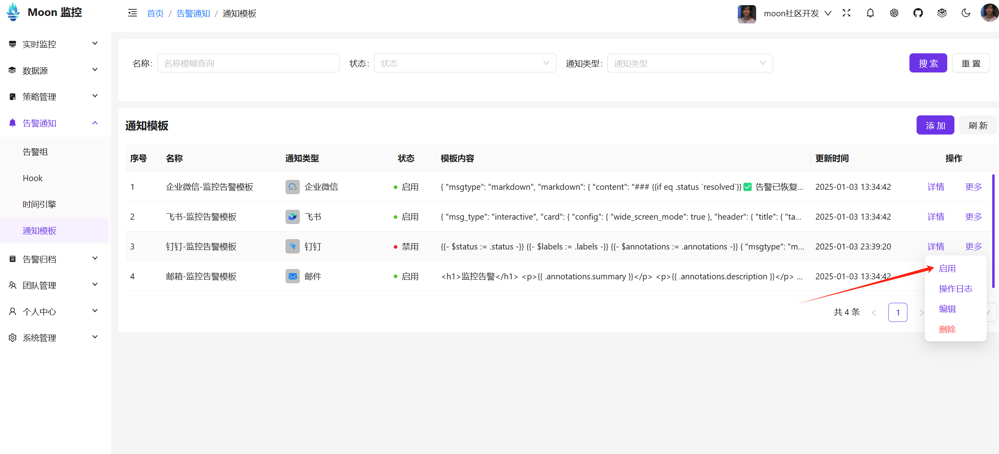
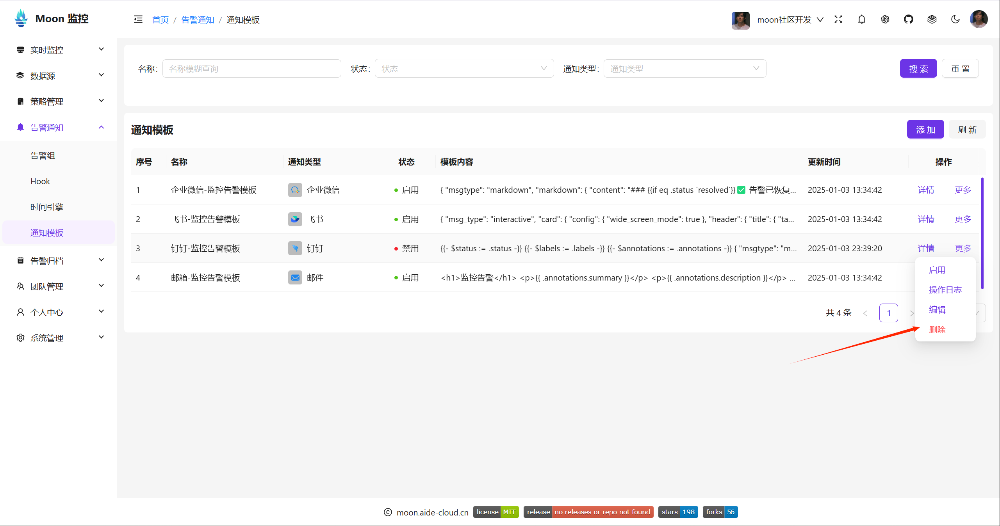

# 告警发送模板

告警发送模板是用于配置告警发送的模板，包括邮件、短信、企业微信、钉钉、飞书等。

## 新建模板
1. 登录Moon控制台，选择左侧菜单中的“告警通知-通知模板”。
2. 在“通知模板”页面，单击页面右上角的“新建模板”按钮。
3. 在弹出的“新建模板”窗口中，填写模板名称、模板类型、状态、模板内容，并单击“确定”按钮。

## 编辑模板
1. 登录Moon控制台，选择左侧菜单中的“告警通知-通知模板”。
2. 在“通知模板”页面，选择需要编辑的模板点击更多按钮，选择编辑。

3. 在弹出的“编辑模板”窗口中，填写模板名称、模板类型、状态、模板内容，并单击“确定”按钮。

## 启用、禁用模板
1. 登录Moon控制台，选择左侧菜单中的“告警通知-通知模板”。
2. 在“通知模板”页面，选择需要启用的模板，点击更多按钮，选择启用。

3. 在“通知模板”页面，选择需要启用的模板，点击更多按钮，选择禁用。

## 模板详情
1. 登录Moon控制台，选择左侧菜单中的“告警通知-通知模板”。
2. 在“通知模板”页面，选择需要查看的模板，选择详情。
3. 在弹出的“模板详情”窗口中，可以查看模板的详细信息。

点击

然后可以查看模板的详细信息。

## 删除模板
1. 登录Moon控制台，选择左侧菜单中的“告警通知-通知模板”。
2. 在“通知模板”页面，选择需要删除的模板，点击更多按钮，选择删除。
3. 在弹出的“删除模板”窗口中，输入模板名称，并单击“确定”按钮。
